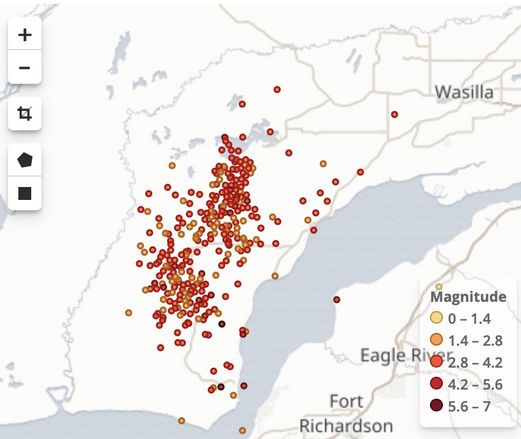

The following framework is implemented using Elasticsearch and Kibana. It performs real-time sentiment analysis of particular content and hash tags in twitter data using the Twitter API. Sentiment analysis is done for all the tweets for #disaster, #rescue, #help , #shootings, #help. The negative tweets' locations are plotted on a map. When we show tweets on a map, we plot them using their latitude and longitude (using Google Maps API).  The map now reflects the locations of disaster stikes.

The framework:

    1. Scrapper(tweets.py):
The scrapper will collect all tweets. The scraper will be a standalone program and will perform the followings:

    a. Collect tweets in real-time with particular hash tags. (#rescue, #help)
    b. After getting tweets we will filter them to check if location field is present or not. 
    
    2. Sentiment Analyzer:
Sentiment Analysis is the process of determining whether a piece of writing is positive, negative or neutral. It's also known as opinion mining, deriving the opinion or attitude of a speaker.

You can use any third party sentiment analyzer like Stanford CoreNLP (java/scala), nltk(python) for sentiment analyzing. For example, you can add Stanford CoreNLP as an external library using SBT/Maven  in your scala/java project. In python you can import nltk by installing it using pip. 

Sentiment analysis using Spark Streaming:

In Spark Streaming, create a Kafka consumer and periodically collect filtered tweets from scrapper. For each hash tag, perform sentiment analysis using Sentiment Analyzing tool (discussed above). Then for each hash tag, send the output to Elasticsearch for visualization.

    3. Visualizer:
Install Elasticsearch and Kibana. Create an index for visualization. Create a map to show all kinds of tweets. After that, create a dashboard to show the map. Dashboard requires data to be time stamped. So, when you send data from Spark to Elasticsearch add a time stamp. In the dashboard set a Map refresh time to 2 min as an example.

ELK tutorial:
https://www.oreilly.com/learning/a-guide-to-elasticsearch-5-and-the-elkelastic-stack
https://www.digitalocean.com/community/tutorials/how-to-use-kibana-dashboards-and-visualizations

For example, this is what I got when I typed 'Earthquakes', 'Alaska' in around January 2019 (Earthquakes are common there, so more dots)

